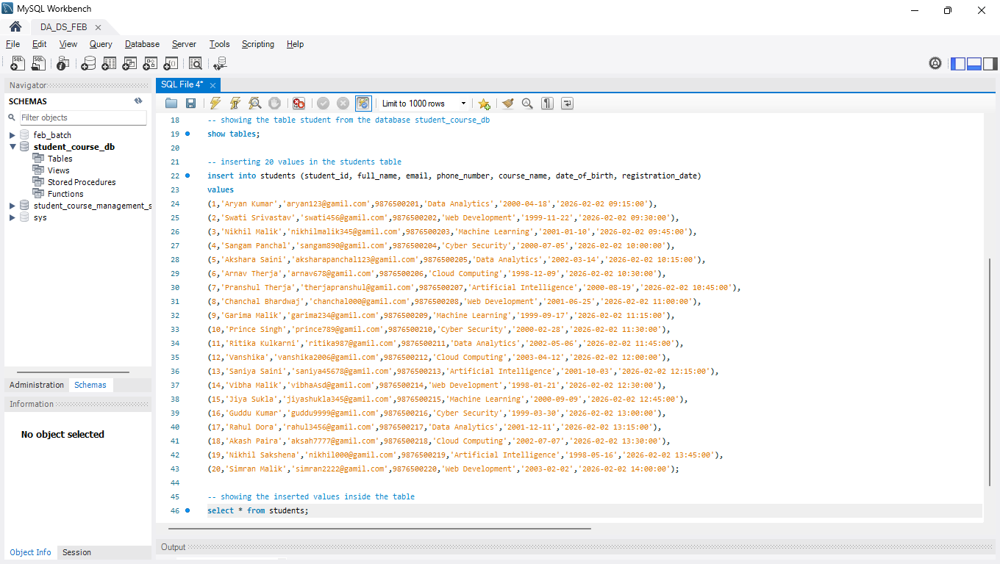

# student_course_management_system_mysql
MySQL Student Course Management System project

I have created a basic student course management system using mysql. i have created the database, created the table and inserted values into the table. i have used the concept of primary key, unique, not null concepts. 

## Project Screenshots

### Creating Database and Table

### Inserting Values

### Showing Inserted Values

