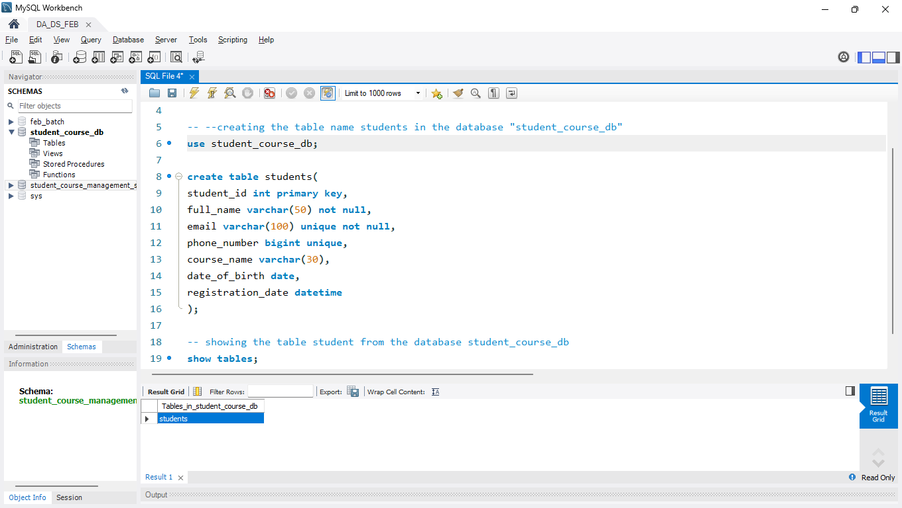
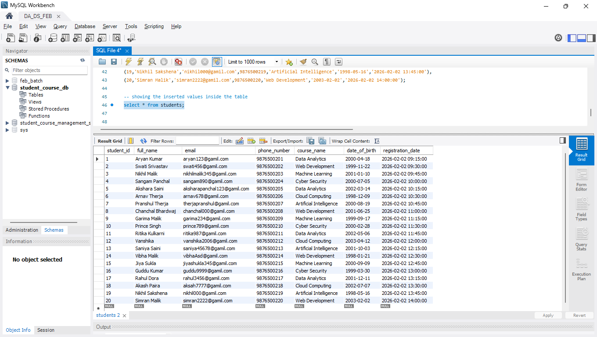

# student_course_management_system_mysql
MySQL Student Course Management System project

I have created a basic student course management system using mysql. I have used the basic concept of database creation, table creation, inserting the values inside the table. and display the table using show tables; command. 

## Project Screenshots

### Creating Database and Table

### Inserting Values

### Showing Inserted Values

